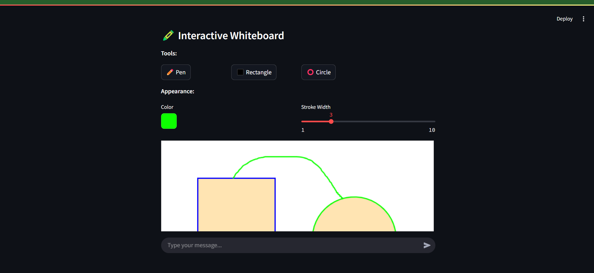

# Gemini AI Assistant



## Overview

The Gemini AI Assistant is a powerful Streamlit-based web application that integrates Google's Gemini AI with a suite of utility functions to create a versatile digital assistant. This tool combines natural language processing with practical system controls, media handling, file management, and annotation capabilities.

## Key Features

### Core Functionalities

- **Gemini AI Integration**: Powered by Google's Gemini 1.5 Flash model for intelligent conversation
- **Chat Interface**: Interactive chat with message history persistence
- **Markdown Support**: Render markdown content directly in conversations

### System Controls

- **Brightness Adjustment**: Modify screen brightness (0-100%)
- **Volume Control**: Adjust system volume levels (0-100%)

### Media Management

- **Media File Navigation**: Open and browse through media files in a folder
- **File Grouping**: Automatically group similar files based on content similarity

### Productivity Tools

- **Distance Calculator**: Get driving distances between locations
- **Telegram Message Search**: Query messages from a Telegram database
- **Text-to-Speech**: Read file contents aloud

### Annotation & Whiteboarding

- **Interactive Whiteboard**: Toggleable drawing canvas
- **Annotation Tools**: Pen, rectangle, and circle drawing tools
- **Canvas Persistence**: Save and restore drawing sessions

## Installation

### Prerequisites

- Python 3.8 or higher
- pip package manager
- Windows OS (for some system controls)
- Google API key for Gemini AI

### Setup Steps

1. Clone the repository:

   ```bash
   git clone https://github.com/Tsegaye16/LLM-function_call
   cd LLM-function_call
   ```

2. Create a virtual environment:

   ```bash
   python -m venv venv
   source venv/bin/activate  # On Windows: venv\Scripts\activate
   ```

3. Install dependencies:

   ```bash
   pip install -r requirements.txt
   ```

4. Set up environment variables:
   Create a `.env` file in the root directory with your Google API key:
   ```
    GOOGLE_API_KEY=your-key
    GOOGLE_MAPS_API_KEY=your-key
    DB_NAME=your-db-name
    DB_USER=your-db-user
    DB_PASSWORD=your-db-password
    DB_HOST=localhost
    DB_PORT=your-db-port
   ```

## Usage

### Running the Application

Start the Streamlit server:

```bash
streamlit run main.py
```

### Basic Commands

- **General Chat**: Just type your message in the chat input
- **System Controls**:
  - "Set brightness to 50%"
  - "Increase volume to 75%"
- **File Operations**:
  - "Group similar files in the Downloads folder"
  - "Open media files in Pictures"
- **Utilities**:
  - "What's the distance between New Addis Ababa and Bahir Dar?"
  - "fetch message from my databse where chanal name is Doctors Ethiopia"
  - "Read aloud the file at documents/notes.pdf"

### Whiteboard Controls

- Enable with: "Open whiteboard with pen tool"
- Tools available: pen, rectangle, circle
- Disable with: "Close whiteboard"

## File Structure

```
gemini-ai-assistant/
├── main.py                 # Main application file
├── config.py              # Configuration settings
├── styles.css             # Custom CSS styles
├── requirements.txt       # Python dependencies
├── README.md              # This documentation
├── utils/                 # Utility modules
│   ├── audio_util.py      # Volume control
│   ├── brightness_util.py # Screen brightness
│   ├── distance_util.py   # Distance calculation
│   ├── file_analysis_util.py # File grouping
│   ├── media_util.py      # Media file handling
│   ├── db_util.py         # Database queries
│   ├── annotation_util.py # Drawing tools
│   ├── canvas_util.py     # Canvas handling
│   └── tts_util.py        # Text-to-speech
```

## Configuration

Modify `config.py` for:

- Database variables
- API endpoints

## Troubleshooting

### Common Issues

1. **COM initialization errors**:

   - Ensure you're running on Windows

2. **Missing API key**:

   - Verify `.env` file exists with correct key
   - Check for typos in the key

3. **Media file issues**:
   - Verify file paths are correct
   - Check file permissions

## Contributing

1. Fork the repository
2. Create a feature branch
3. Submit a pull request

## License

This project is licensed under the MIT License - see the LICENSE file for details.

## Acknowledgments

- Google for the Gemini AI API
- Streamlit for the web framework
- All open-source libraries used in this project
